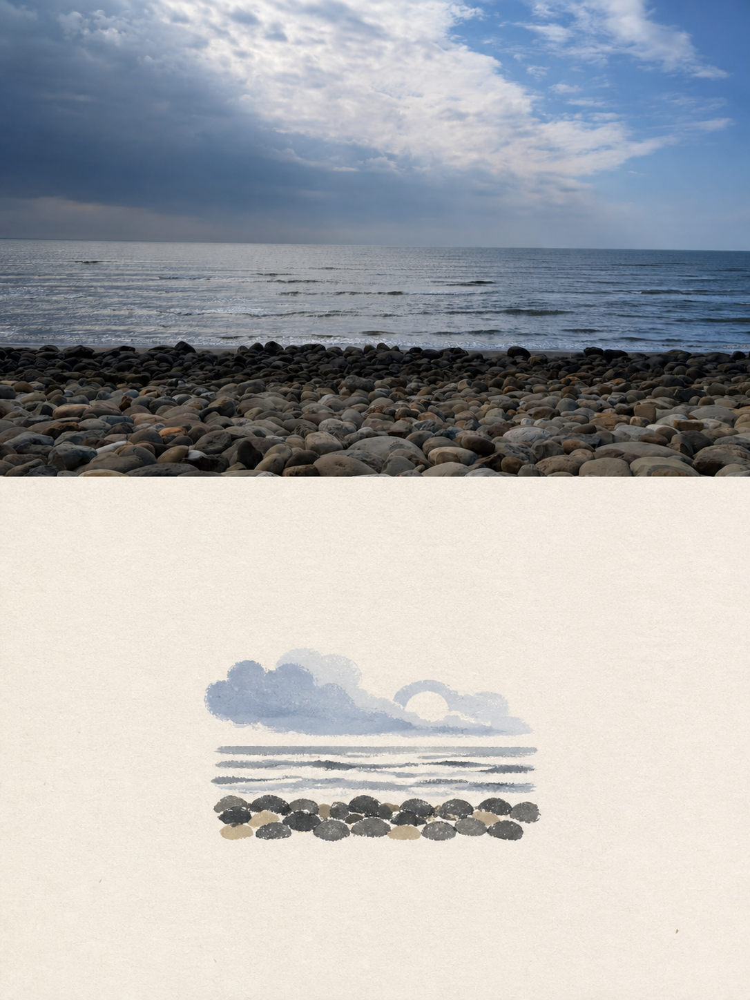
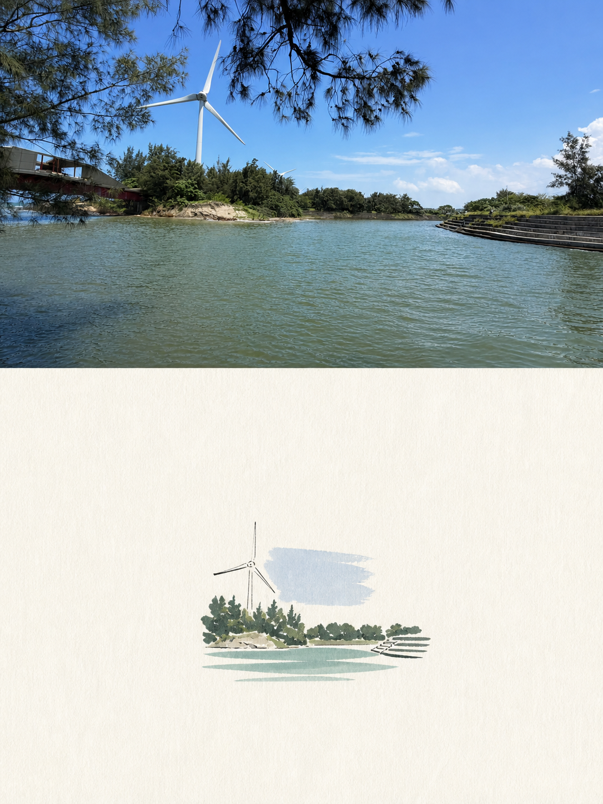

# Editorial Photo Poster

一個把上傳照片轉成獨立高端編輯海報的 Codex skill：保留原照片在上半部，並在下半部以同一場景衍生出小型、極簡的手繪紙張插畫。

An editorial Codex skill for turning each uploaded photograph into one independent 3:4 art-publication poster. The source photo remains photographic in the top half, while the bottom half becomes a small, restrained hand-drawn paper illustration derived from the same scene.

## Examples





## What it does

- Creates one poster per uploaded photograph; images are never combined into a collage.
- Uses a strict vertical 3:4 canvas with an exact 50/50 horizontal split.
- Preserves the source photograph faithfully in the top half.
- Reinterprets recognizable scene elements as a small centered paper illustration with generous negative space.
- Keeps the illustration palette restrained and derived from the source image.

## Use it

Upload a photograph and invoke `/editorial-photo-poster`.

For a local installation, place this repository directory at:

```text
~/.codex/skills/editorial-photo-poster
```

The full behavior and composition contract lives in [`SKILL.md`](SKILL.md). Agent metadata is in [`agents/openai.yaml`](agents/openai.yaml).

## Repository layout

```text
.
├── SKILL.md
├── agents/openai.yaml
├── assets/70953-editorial-photo-poster.png
└── assets/70963-editorial-photo-poster.png
```

## Example assets

The included examples show the intended direction:

- `assets/70953-editorial-photo-poster.png`: a quiet rocky shoreline photograph above a small paper illustration using slate blue, pale sky blue, charcoal, and muted stone beige.
- `assets/70963-editorial-photo-poster.png`: a waterfront wind turbine photograph above a small paper illustration using cobalt sky blue, muted turquoise, deep charcoal green, and warm off-white.

## License

The skill code and documentation are released under the MIT License. See [`LICENSE`](LICENSE).
